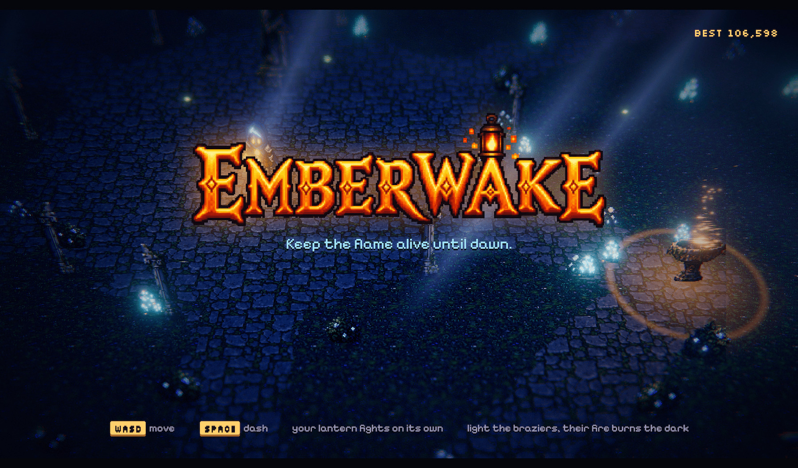
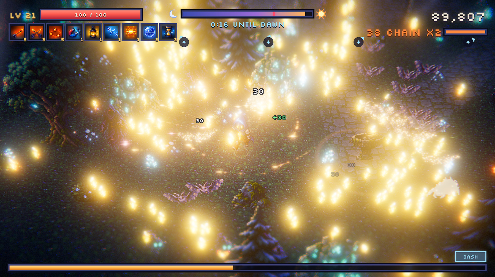
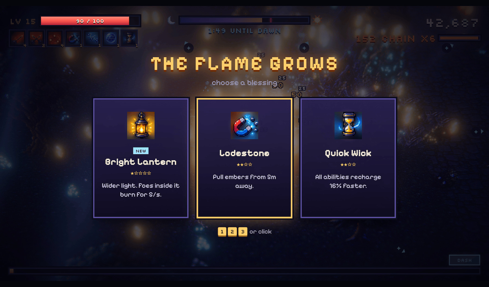

# Emberwake

Keep the flame alive until dawn. A pixel-art HD-2D survival game for the browser.

**Play:** https://emberwake.mogita.rocks

<p align="center">
  
</p>
<p align="center">
  
  
</p>

## How to play

- `WASD` or arrows to move, `Space` to dash. Gamepad works too.
- Your lantern fights on its own. Collect embers, level up, pick 1 of 3 blessings.
- Stand beside a brazier to light it. Its fire burns the dark.
- Survive five minutes until dawn. The Moonmoth Matriarch arrives at 3:30.

## Run locally

```bash
npm install
npm run dev
```

Built with Three.js and WebAudio. All art was generated with the Codex CLI and snapped to a pixel grid with `tools/pixelize.py`. All music and sound effects are synthesized in code.

## License

MIT © [mogita](https://github.com/mogita)
